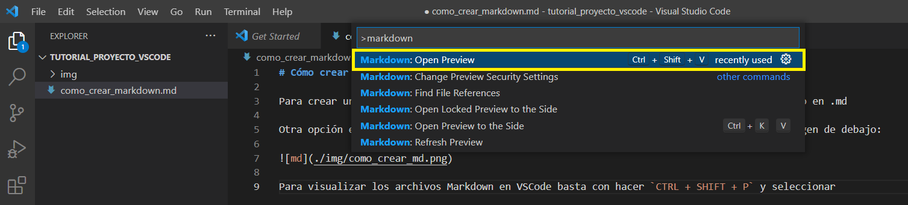

# Cómo crear un archivo Markdown

Para crear un archivo Markdown, basta con abrir el bloc de notas y crear un archivo acabado en .md

Otra opción es en Microsoft VSCode crear un archivo y acabarlo en .md como se ve en la imagen de debajo:

Para visualizar los archivos Markdown en VSCode basta con hacer `CTRL + SHIFT + P` y seleccionar `Markdown: Open Preview` o directamente mediante el **shortcut** `CTRL + SHIFT + V`.

