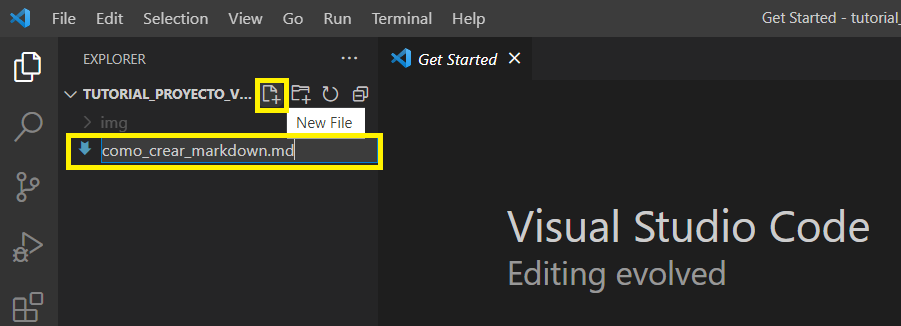

# Estableciendo el entorno adecuado para desarrollar en Python en Visual Studio Code

Nada más abrir Microsoft Visual Studio Code nos vamos a **Extensiones** (`CTRL + SHIFT + X`) e instalamos `Code Runner` y `Python`.


# Cómo crear un proyecto de Python en Microsoft VS Code

Para crear un proyecto de Python en Microsoft VS Code hay primero que crear en el sistema una carpeta de proyecto o clonar un repositorio.

Posteriormente seleccionamos **File > Open Folder** y seleccionamos la carpeta que hemos creado:


Finalmente, creamos el archivo `.py` haciendo doble-click en la barra de debajo o en el icono:


# Cómo crear un entorno virtual

Para cualquier proyecto de Python es necesario crear un entorno virtual. Esto se debe hacer como buena práctica para evitar conflictos entre las diferentes versiones de las librerías entre diferentes proyectos.

Para crear un entorno virtual, es necesario tener antes instalada la librería `venv`. Para ello, abrimos una nueva terminal de Python haciendo `CTRL + SHIFT + P` y escribiendo `Python: Create Terminal`.

 

También se puede crear en la barra superior en **Terminal > New Terminal**. En cualquier caso, tendremos que hacer un cambio y es que si lo hemos abierto haciendo `CTRL + SHIFT + P` veremos que la terminal es de Python, mientras que si lo hemos hecho de la última forma veremos que se ha abierto Powershell.

Lo que tenemos que hacer es modificarla para que sea **CMD** o **Command Prompt**.

 

Una vez estamos con **CMD** y **siempre chequeando que estamos en la carpeta del proyecto** escribimos:

```python
python -m venv .env
```
De tal manera que creamos un entorno virtual llamado `.env`. Podremos ver cómo esta carpeta se ha creado en nuestro proyecto.
**NOTA: Es importante que el nombre comience con un punto, para que luego GIT ignore el entorno y poder subirlo todo bien a Github**.


El siguiente paso es activar el entorno virtual. Para ello escribimos en la terminal:

```python
.env\Scripts\activate
```
Y podemos ver cómo ya estamos en `.my-env`. Para salir de este entorno bastaría con escribir `deactivate`.

Mediante el comando `pip freeze` podemos ver qué librarías tenemos.
Para instalar, basta con usar el normal pip install.


Podemos exportar nuestras librerías mediante `pip freeze > requirements.txt`.
Así, veremos que se ha creado un archivo llamado requirements.


Con todo ello, podemos empezar a trabajar. De hecho, yendo al script de Python podemos correr el código haciendo click en `Run Interactive Window` e instalando las dependencias necesarias, al estilo jupyter notebook.


Podemos ver ahí el entorno virtual seleccionado, incluso, arriba a la derecha, donde pone `.my-venv`.

## Cómo cerrar un Proyecto

Para cerrar un proyecto basta con hacer click en **File > Close Folder**.