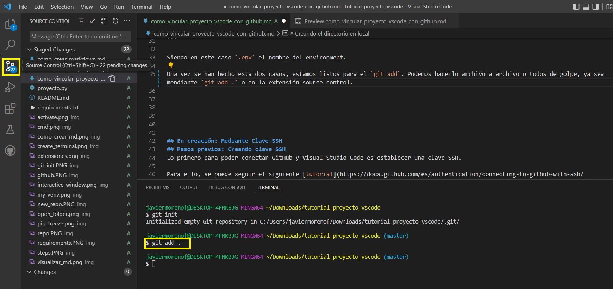

# Creando el repositorio en GitHub
Lo primero de todo es crear un repositorio en GitHub:


Posteriormente, veremos que aparece una dirección HTTPS y una SSH. Depende de cómo queramos trabajar, usaremos una u otra. En este ejemplo se usará HTTPS:


# Requerimientos:

Para vincular un proyecto de Microsoft Visual Studio Code con Github es necesario:
- Tener instalada la extensión `Github Pull Requests and Issues`.
- Tener instalado Git en el ordenador

# Creando el directorio en local
En el directorio que estamos trabajando en local, tenemos que crear un repo de Git.

Para ello, basta ejecutar en la carpeta que estamos trabajando `git init`.


Tenemos que asegurarnos que se haya creado un documento `.gitignore`.

Si no es así creamos un archivo como si fuera `.txt` pero que se llame `gitignore.` sin extensión. Es importante el punto al final.
Dentro de él añadimos el entorno que se ha creado:

```python
.gitignore
.env
```

Siendo en este caso `.env` el nombre del environment.

Una vez se han hecho esta dos casos, estamos listos para el `git add`. Podemos hacerlo archivo a archivo o todos de golpe, ya sea mendiante `git add .` o en la extensión source control.



Una vez tenemos los cambios en stage, podemos hacer `git_commit -m {mensaje}`.

Posteriormente indicamos la branch `git branch -M main`.

Luego hacemos `git remote add origin https://github.com/javiermorenof/VSCode_Tutorials.git`

Finalmente `git push -u origin main`


## En creación: Mediante Clave SSH
## Pasos previos: Creando clave SSH
Lo primero para poder conectar GitHub y Visual Studio Code es establecer una clave SSH.

Para ello, se puede seguir el siguiente [tutorial](https://docs.github.com/es/authentication/connecting-to-github-with-ssh/generating-a-new-ssh-key-and-adding-it-to-the-ssh-agent)

Pero básicamente, es necesario abrir la consola y escribir:

```python
ssh-keygen -t ed25519 -C "email@dominio.com"
```

Siendo email@dominio el email de Github.

Cuando nos pida indicar el archivo donde se va a guardar damos a enter y finalmente protegemos mediante contraseña.

Posteriormente, entramos donde se ha creado el `ssh` y abrimos con el bloc de notas el archivo `.pub`.

Copiamos la clave pública SSH y la añadimos a Github en **Settings**


## Cómo vincular un proyecto en Microsoft Visual Studio Code con Github


Es necesario también tener instalado **Git** en el ordenador.

Dentro de la carpeta de proyecto hacemos un `git init`.


Si hacemos `git status` podemos ver si hay algo modificado.

Hacemos `git add {archivo}` o `git add .` para añadir todo de golpe.

Finalmente hacemos `git commit -m {mensaje}`


Fuente: https://www.sachinsf.com/how-to-push-the-code-from-vs-code-to-github/#:~:text=To%20push%20the%20code%20to,push%20your%20folder%20to%20Github.